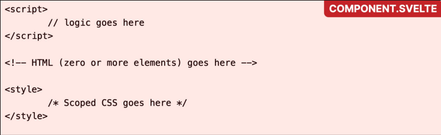

# Intro to Svelte & SvelteKit

[Svelte](https://svelte.dev) is a modern front-end framework for building web applications. It compiles your components into highly efficient, plain JavaScript code that updates the DOM directly, which results in faster performance and smaller bundle sizes.

- language, compiler, and frontend framework

    - Less client-side JS
    
    - Easier syntax

    - Efficient

- SvelteKit: the full-stack framework built on top of Svelte

- `Component.svelte`

    - Represents a UI component for your website

    - Imported explicitly

- `+page.svelte`

    - Represents a page in SvelteKit's routing system

    - Route is determined based on folder location in your directory

    - Automatically rendered when the user visits the URL matching its folder path

- `+layout.svelte`

    - Represents a shared layout that will be applied to all the pages in its folder

    - Wraps the `+page.svelte` (child pages) defined by `<slot />` inside it

    - Applies persistent UI (i.e. navbar)

- Svelte anatomy

    

# Intro to D3

In this tutorial you will learn how to create your first D3 implementation. We will show you how to draw basic SVG shapes and how to bind it to data values. We will also reiterate advanced JS concepts: *method chaining*, *anonymous functions*, *asynchronous execution*, and *callbacks*.

## Tutorial Outline

    1. D3 Overview
    2. SVG Playground
    3. Interactive Multi Views

### D3 Overview

- VizQL (Tableau) uses high level terms for specifying visualizations, but can be limited by the available mark types. 

- D3 is a visualization grammar. It allows developers to bind data to the properties of graphical marks, and have an additional set of operators to specify this mapping with more fine-grained control. 

- D3 is a javascript library introduced by Mike Bostock and Jeff Heer in 2009 @ Stanford. Originally named - Protovis (2009 - 2011)

- Declarative, domain-specific specification language for manipulating the DOM (document object model)

- D3 is a really powerful for-loop that chaining many useful helper functions together
We will use D3 version 7 in this course. Most online examples use version 3. The differences between version 4 and 7 are mostly minor.

- D3 `select`
    
    - Similar to CSS selectors and used to grab DOM elements. The function returns the first element in the DOM that matches the selector. If you need to select more than one element, use `selectAll`. You can operate on the selection as a whole rather than iterating over every item. 

- D3 `append`

    - After selecting a specific element, you can add a new element as the child of the current selector.

- `d` and `i`: `d` represent current data and `i` represent index. The index is the second argument/parameter in function call. 

- If styles should be applied to a set of elements (by class), then assign them in the external CSS.

### SVG Playground

- **SVG (Scalable Vector Graphics)**

- `SVG` is XML vector graphics that tag with attributes. `SVG` supports a wide range of graphical components (shapes) such as `rect`, `circle`, `line`, `path`, `ellipse`, and `text`. 

- `SVG` elements can be added directly within HTML or dynamically inserted into the DOM using D3/JS. 

- `SVG` elements can also be styled using CSS. 

- The `SVG` coordinate system starts from the *top-left* corner as the origin **(0, 0)**. You will need to provide the `width` and `height` for the `SVG` element. 

- `Width` and `height`: These attributes define the size of the `SVG` viewport. If the `viewport` changes the `SVG` may not scale accordingly.

- `viewBox`: attribute defines the coordinate system and aspect ratio of the SVG. It takes four values separated by spaces: `min-x` `min-y` `width` `height`. These values define a rectangular area in the `SVG` coordinate system. It allows you to define what part of the SVG graphic is visible within the viewport. It doesn't directly control the size of the `SVG` canvas but rather how the `SVG` content is scaled and positioned within the viewport.

    

- The `g` element: allows you to group a set of elements together. After grouping, you can perform operations on the group rather than each individually. Each `g` element starts its coordinate system with the origin **(0, 0)** in the top-left corner. 

    
 
### D3 Data Binding (No longer needed for modern framework)

- `Enter`: contains/create placeholders for every data that did not have a corresponding element

- `Update`: contains existing elements that are bound to the data

- `Exit`: contains existing elements but cannot be found in the data and should be removed

- `Join`: shortcut for the enter-update-exit pattern   

    

### D3 Scales

- Functions that map from an input domain to an output range. For example: We want to visualize the monthly sales of a retail store. The input data is between 0 and 20,000 dollars and the maximum height of the chart is 400px. We take an input interval (`domain`) and transform it into a new output interval (`range`).

    

- **Linear scales** are used to transform continuous quantitative data into the output range while preserving proportional differences.

- **Power scales**: similar to linear scale, except an exponential transform is applied to the input domain value before output range value is computed.

- **Time scales**: variant of linear scale with a temporal domain, the transformation is based on calendar intervals. The domains are required to be in JS date objects

- **Band scales**: used to transform ordinal or categorical attributes; typically used for bar charts

    

- **Color scales**: usually applied with ordinal scales that have a discrete domain and range. 

    - D3 offers many different built-in color palettes: categorical or linear or diverging

    - Instead of using a fixed range of colors, you can use linear scale functions to create color gradients

### D3 Axes

- An axis is the visual representation of a scale

- D3 provides 4 methods to create axes with different `position`/`orientation` (`top`, `right`, `left`, `bottom`)

- An axis component contains reference line, labels, ticks

- Refine the axis
    - Tick formatting: percentage `tickFormat(d3.format(‘.0%’))`
    
    - Number of ticks: `ticks(6)`
    
    - Remove tick marks at the beginning and end of an axis: `tickSizeOuter(0)`

- Add axis to SVG by using the `call()` function and usually with a `g` element

### Tooltip

- To create an interactive visualization, tooltips need to be considered. You can show tooltips to reveal more details about the dataset to the audience. 

- The recommended approach: create a global tooltip container outside of the SVG that you can show/hide and position whenever users hover over a mark (with this approach, you can style the tooltip objects with CSS and add images or small visualization into it)

- By default, the `tooltip` `
` will have set to `absolute` position and `hide` or `opacity: 0`

- In D3, you can update tooltip contents, position, and visibility when users hover over a mark

    - The most common events: `mouseover` `mousemove` `mouseleave`

    - For small visualization use `mouseover` `mousemove`

### Multi Views (Dashboard)

- Linked charts with interactions

    - Visualization systems/applications are often contained with multiple charts. Analytical dashboards help users understand:

        - What happened in the dataset

        - Why it happened and what may happen

        - What actions you should take

    - To show different perspectives of visualizations/datasets can be done using interactions (linked highlighting and filtering), such as detail-on demand (overview-detail) or to facet data across multiple views.

